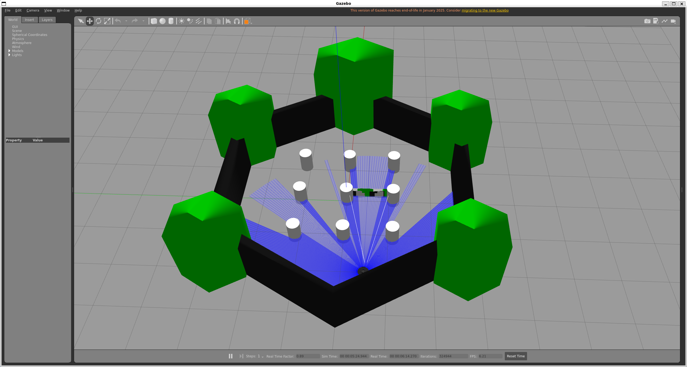
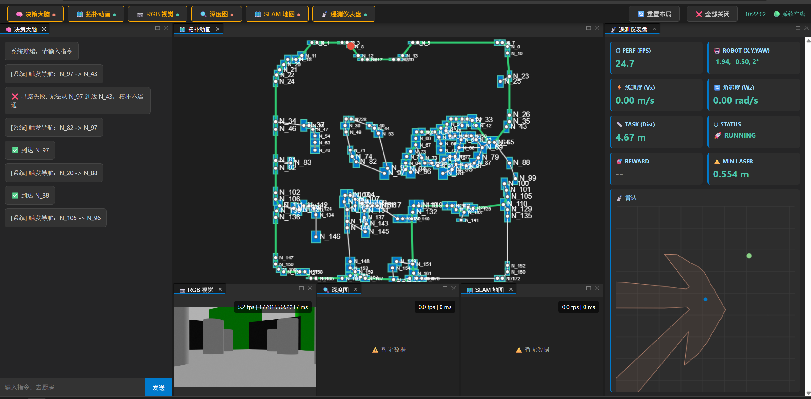
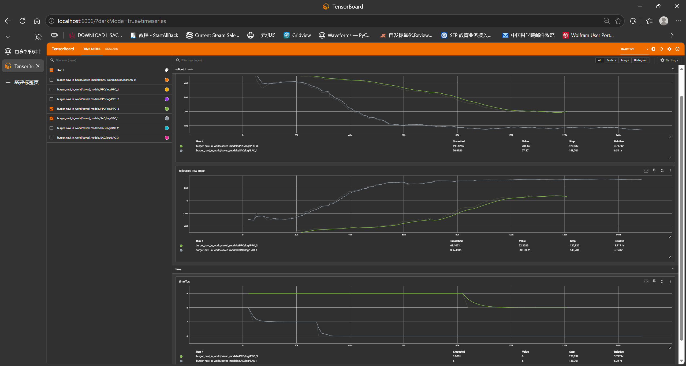
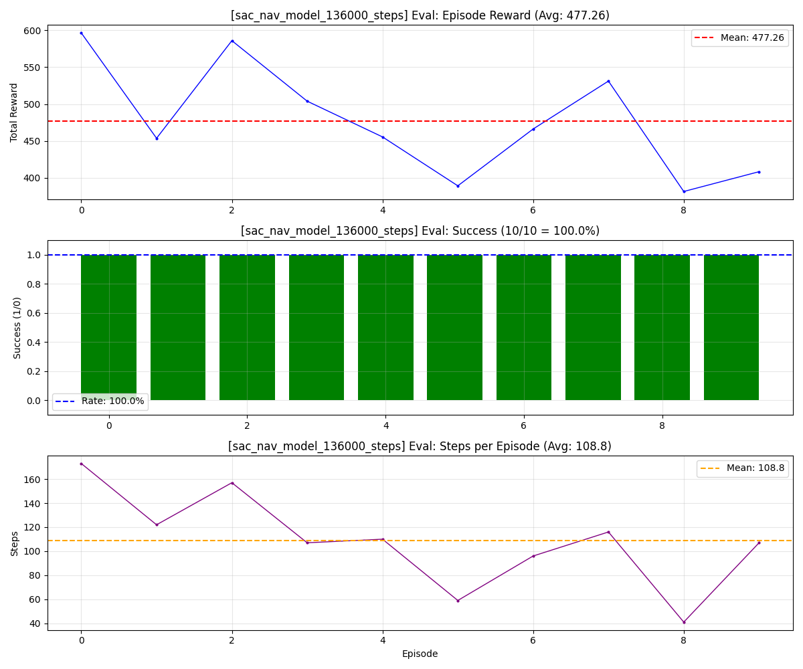
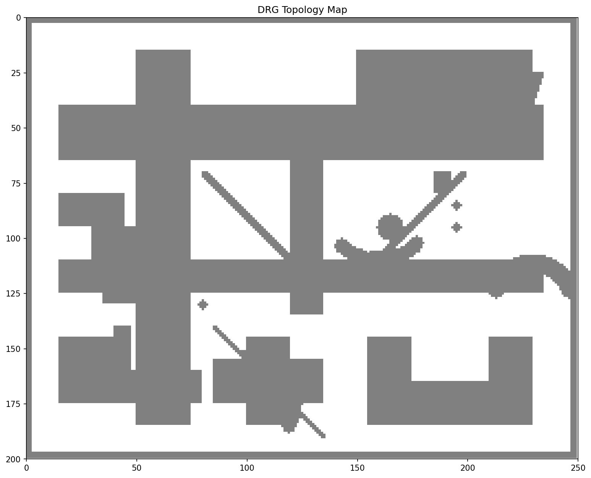
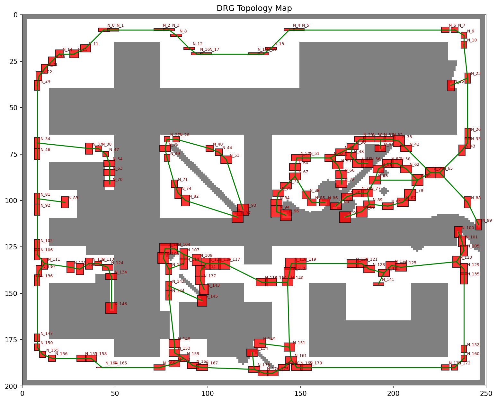

# -5. Tech Stack
- 🏢 0. 基础设施：
    - Windows WSL2: Ubuntu 22.04 LTS (Jammy)
    - Docker
    - ROS2 Humble
---
- 🧠 1. Perception（感知层）

    *从原始传感器数据提取语义与拓扑结构*
    <!-- - **SLAM 与 基础建图**：
        - `Cartographer`：构建 2D 栅格地图
        - `make_baseline_grid`：生成基础占位栅格 -->
    - **视觉目标检测（实体识别 + 开放词汇检索）**：
        - `YOLO`：高频/基础目标检测
        - `GroundingDINO` (`groundingdino_swint_ogc.pth` + `bert-base-uncased`)：零样本文本驱动目标检测
    - **空间认知与拓扑提取**：
        - `拓扑图 (topological graph)`：从栅格图（DRG）基于Voronoi diagram提取拓扑节点与边
---
- 🎯 2. Decision（决策层）

    *小脑*
    - **强化学习策略**：
        - `Stable Baselines3`：RL 算法库，PPO+SAC
        - `PyTorch CUDA`：神经网络计算后端
    - **自定义 RL 环境与奖励工程**：
        - 封装 ROS2 状态为 Gym 环境
        - 密集奖励设计：到达目标(+)、接近目标(+)、朝向奖励(+)、动作平滑性(+) / 碰撞惩罚(-)、时间惩罚(-)、卡住惩罚(-)、安全距离惩罚(-)
---
- 🗺️ 3. Planning（规划层）

    *自然语言转化为结构化任务*
    - **大模型意图理解**：
        - `LangGraph`：
            - 规划状态图、行为树
            - 基于 mission block架构给出任务时序规划
    - **基于图的RAG**：
        - Neo4j
    - `A*算法`：硬规则获取节点间路径
    <!-- - **传统 Nav2 导航栈**：
        - `Nav2` (`navigation2`, `nav2-bringup`)：全局/局部路径规划器
        - 算法插件：如 NavFn/Dijkstra 全局规划，DW/TEB 局部避障规划 -->
- 🏃 4. Execution（执行层）
    *下发控制指令与底层底盘驱动*
    - **ROS2 同异步状态控制接口**
    - 封装常见动作接口

---
- 🖥️ 5. Simulation（仿真环境）
    *物理沙盒与通信*
    <!-- - **系统环境**：`Windows WSL2` (Ubuntu 22.04) + `Docker` (解决环境隔离与依赖) -->
    - **物理仿真引擎**：`Gazebo` (运行 `turtlebot3_house.launch.py`，提供激光雷达/RGB-D仿真)
    - **通信穿透配置**：`FastDDS` (配置 `fastdds_no_shm.xml` 强制 UDP，打通 WSL 与 Docker 的 ROS2 域)
    - **TurtleBot3 差速小车**：
        - `Burger`：baseline 演示
        - `Waffle`：真实场景/域随机化演示

---
- 📺 6. 监视器
    *状态可视化与前端交互*
    - 可视化
        - `Tensorboard`: RL训练曲线监控
        - `Rviz`: Gazebo小车状态
        - **网页前端App**
            - **Web 后端框架**：`FastAPI`
                - **Service (HTTP)**：处理异步指令（如重置世界、切换模式、下发 RAG 指令）
                - **WebSocket**：全双工实时推流（RL 训练曲线、DRG 图谱状态、遥测数据）
            - **ASGI 服务器**：`Uvicorn` (高并发异步驱动)
            - **前端可视化**：渲染栅格地图、DRG 拓扑图、RGB/Depth 视频流

---
- 🏇 7. Harness（防护与治理框架）
    *Agent 行为的安全兜底、约束与可观测性*
    - **LLM 输出规范与校验**：
        - 基于 `Pydantic` 与 `OpenAPI Schema` 定义严格的输出数据模型，强制约束 LLM 生成规范的结构化指令（如 JSON 格式的目标点、动作），拦截模型幻觉与非法指令；
    - **行为审计**：
        - 构建结构化执行日志体系，完整记录 Agent 思维链、状态流转与底层动作，实现系统行为的可审计与异常状况的定位追溯；
    - **异常拦截兜底**：
        - 基于 `LangGraph` 完备状态图设计异常处理分支（如动作执行超时熔断、越界重置、状态回退等），应对工具调用失败或状态异常等基础状况，防止流程死锁与失控。

# -4. Notes
- Tech and debug notes see [rl-navibot/docs](https://github.com/chendawe/rl-navibot/tree/main/docs).


# -3. Project Structure
<!-- 
- Presentation Videos
[TBD](https://MMM.TBD.cow). -->

- Structure diagram:


# -2. Baseline Presentations
- Web Monitor
    - 启动仿真环境
        ```sh
        # WSL Ubuntu：
        # export FASTRTPS_DEFAULT_PROFILES_FILE=~/fastdds_no_shm.xml
        # export RMW_FASTRTPS_USE_QOS_FROM_XML=0


        # WSL Ubuntu：
        # cd /home/chendawww/workspace/rl-navibot
        # source install/setup.sh

        # docker start -i ros2my

        # docker ros2_my：
        source /opt/ros/humble/setup.sh && \
        cd ~/workspace/turtlebot3_ws && \
        source install/setup.sh

        export TURTLEBOT3_MODEL=waffle
        ros2 launch turtlebot3_gazebo turtlebot3_house.launch.py
        ```

        ```sh
        (ros2) chendawww@cdws:~/workspace/rl-navibot$ ~/workspace/rl-navibot/app/start.sh
        INFO:     Will watch for changes in these directories: ['/home/chendawww/workspace/rl-navibot']
        INFO:     Uvicorn running on http://0.0.0.0:8000 (Press CTRL+C to quit)
        INFO:     Started reloader process [729824] using StatReload
        INFO:     Started server process [729826]
        INFO:     Waiting for application startup.
        🌐 检测到 Web 独立启动，主动初始化 Ros2Runtime...
        ✅ Ros2Runtime 自主初始化完成
        ✅ 成功实例化并注册 RobotBridge
        ✅ 成功实例化并注册 RGBStreamer
        ✅ 成功实例化并注册 DepthStreamer
        ✅ 成功实例化并注册 MapProvider & MapUpdateTrigger
        ⚠️ 未检测到 RL Env
        🚀 所有 Service 组装完毕
        INFO:     Application startup complete.
        ```
        - 仿真状态
        
        - monitor追踪状态
        
        - web monitor 演示：
        [bilibili: EI_console_manipulation](https://www.bilibili.com/video/BV1LcLu6tEmH?p=2)
        <!-- <video width="640" height="360" controls>
        <source src="README_imgs/EI_console/EI_console_manipulation.mp4" type="video/mp4">
        </video> -->

        - 拓扑图路径硬规划 baseline 演示：
        [bilibili: EL_topo_pathing](https://www.bilibili.com/video/BV1LcLu6tEmH?p=3)
        <!-- <video width="640" height="360" controls>
        <source src="README_imgs/EI_console/EI_topo_pathing_baseline.mp4" type="video/mp4">
        </video> -->


- RL: Train, Eval and Enjoy
    - Train (Tensorboard， PPO _v.s._ SAC)
    ```
    tensorboard --logdir /home/chendawww/workspace/rl-navibot/A_tries
    ```
    
    - Eval (eval SAC)
    
    - Enjoy (Waffle in arena world)
    [bilibili: RL_enjoy_SAC](https://www.bilibili.com/video/BV1LcLu6tEmH?p=1)

        ```sh
        ==================================================
        🚀 RL Navigation Evaluator (Eval)
        ==================================================
        📍 Python脚本 : /home/chendawww/workspace/rl-navibot/src/decision/decision/rl/useful_scripts/eval.py
        🤖 模型文件   : sac_nav_model_136000_steps.zip
        完整路径   : /home/chendawww/workspace/rl-navibot/A_tries/burger_navi_in_world/saved_models/SAC/sac_nav_model_136000_steps.zip
        ⚙️  算法配置   : /home/chendawww/workspace/rl-navibot/A_tries/burger_navi_in_world/configs/train.config.yaml
        🌍 环境配置   : /home/chendawww/workspace/rl-navibot/src/decision/decision/rl/useful_env_configs/rl_env.world.config.yaml
        🎯 测试局数   : 10
        🔍 Verbose    : ON
        ==================================================
        ⏳ 正在启动评估环境，请稍候...\n

        ============================================================
        🤖 TurtleBot3 Navigation Env Configuration
        ============================================================
        robot Name   : waffle
        World Name : ttb3_world
        ------------------------------------------------------------
        📡 Env robot Config (Physics & Hardware):
        - name                                : waffle
        - laser_range_max                     : 3.5
        - laser_beams_num                     : 24
        - laser_noise_threshold               : 0.12
        - lin_vel_max                         : 0.22
        - ang_vel_max                         : 1.5
        - lin_vel_stuck_threshold             : 0.12
        - lin_acc_physics_max                 : 2.0
        - ang_vel_imu_physics_max             : 3.0
        - proximity_to_collision_threshold    : 0.15
        - proximity_to_be_safe_min            : 0.35
        ------------------------------------------------------------
        🗺️  Env World Config (Task & Map):
        - name                                : ttb3_world
        - episode_steps_max                   : 500
        - step_duration                       : 0.1
        - dist_to_goal_threshold              : 0.3
        - dist_to_goal_gen_min                : 1.0
        - dist_to_goal_clip_norm              : 5.0
        - reset_mode                          : teleport
        - safe_zones                          : 13 points in 5 zones
            Zones:                            : ['zone_arena_bottom', 'zone_arena_left', 'zone_arena_right', 'zone_arena_top', 'zone_pillars']
        ------------------------------------------------------------
        🎁 Reward Config:
        - name                                : ttb3_world
        - reward_at_goal                      : 300.0
        - penalty_at_collision                : -300.0
        - reward_factor_approaching_goal      : 20.0
        - penalty_elapsing_time               : -0.2
        - penalty_stuck                       : -0.05
        - reward_good_orientation             : 2.0
        - penalty_factor_in_safe_proximity    : -5.0
        - penalty_instability                 : -2.0
        - penalty_action_smoothness           : -0.5
        ------------------------------------------------------------
        🧠 RL Core Config:
        - Obs Shape                           : (38,)
        - Act Space                           : [-0.22, 0.22], [-1.50, 1.50]
        ============================================================

        ==================================================
        Mode       : Evaluation (Eval)
        Algorithm  : SAC
        World      : ttb3_world
        robot        : waffle
        Model      : sac_nav_model_136000_steps.zip
        Episodes   : 10
        Verbose    : True
        ==================================================

        [Load] 正在加载模型...
        Wrapping the env with a `Monitor` wrapper
        Wrapping the env in a DummyVecEnv.
        [Load] 模型加载成功，训练步数: 136000

        [Eval] 开始评估 (10 episodes)...
        Spawn check timeout. Min dist: 0.282m < Threshold: 0.315m
        Validation failed, retry 1/5...

        [Ep Start] Spawn:(0.4117403279953608, -1.8128424463924322) | Goal:(1.7718932721641816, 0.7074703958291945) | Obs Shape:(38,)
        Step 0: Act=[-0.190, 0.912], reward=-2.693739175796509
        Step 1: Act=[-0.162, 1.206], reward=-4.852521657943726
        ...
    ```


- Brain Graph of Harness
    - 启动
        ```sh
        (ros2) chendawww@cdws:~/workspace/rl-navibot$ python /home/chendawww/workspace/rl-navibot/src/planning/planning/brain/entrypoints/brain_main.py
        🚀 Replan 架构可行性测试
        22:28:41 | BrainNode.Input      | 系统挂起，等待用户输入...

        👤 你 (试试: 去厨房拿水 / 闲聊 / 关机): 
        ```
        - 闲聊
        ```sh
        👤 你 (试试: 去厨房拿水 / 闲聊 / 关机): 你好
        22:32:15 | BrainNode.Input      | 系统挂起，等待用户输入...
        22:32:15 | BrainNode.Input      | 收到用户输入: 你好
        22:32:15 | BrainNode.Planner    | [Planner] 开始解析: 你好
        22:32:16 | httpx                | HTTP Request: POST https://open.bigmodel.cn/api/paas/v4/chat/completions "HTTP/1.1 200 OK"
        22:32:16 | BrainNode.Planner    | [Planner] 意图识别完成: chat
        22:32:16 | BrainNode.Input      | 系统挂起，等待用户输入...

        🤖 你好呀

        👤 你 (试试: 去厨房拿水 / 闲聊 / 关机): 
        ```
    - 任务执行成功
        ```
        👤 你 (试试: 去厨房拿水 / 闲聊 / 关机): 去厕所看看弟弟在不在里面，然后刚刚外卖员打电话来了，不知道外卖是不是到了，你去看看，没到的话先在门口等着吧；小心卧室走廊门口的那滩水，没来得及拖呢
        22:34:37 | BrainNode.Input      | 系统挂起，等待用户输入...
        22:34:37 | BrainNode.Input      | 收到用户输入: 去厕所看看弟弟在不在里面，然后刚刚外卖员打电话来了，不知道外卖是不是到了，你去看看，没到的话先在门口等着吧；小心卧室走廊门口的那滩水，没来得及拖呢
        22:34:37 | BrainNode.Planner    | [Planner] 开始解析: 去厕所看看弟弟在不在里面，然后刚刚外卖员打电话来了，不知道外卖是不是到了，你去看看，没到的话先在门口等着吧；小心卧室走廊门口的那滩水，没来得及拖呢
        22:34:42 | httpx                | HTTP Request: POST https://open.bigmodel.cn/api/paas/v4/chat/completions "HTTP/1.1 200 OK"
        22:34:42 | BrainNode.Planner    | [Planner] 意图识别完成: mission
        22:34:43 | httpx                | HTTP Request: POST https://open.bigmodel.cn/api/paas/v4/chat/completions "HTTP/1.1 200 OK"
        json
        [
        {
            "block_type": "navi",
            "target": "厕所"
        },
        {
            "block_type": "observe",
            "target": "弟弟"
        },
        {
            "block_type": "navi",
            "target": "门口"
        },
        {
            "block_type": "observe",
            "target": "外卖"
        }
        ]
        
        22:34:43 | BrainNode.Planner    | [Planner] 任务拆解成功 -> 生成 4 个 blocks
        22:34:43 | BrainNode.Action     | [ExecuteBlock] ▶ 准备执行 [1/4] {'block_type': 'navi', 'target': '厕所'}
        22:34:43 | BrainNode.Action     | [ExecuteBlock] 调用底层 -> type=navi, target=厕所
        22:34:43 | planning.brain.clients.llm_client | [FakeEnvironmentLLM] 模拟执行 -> type=navi, target=厕所
        22:34:44 | httpx                | HTTP Request: POST https://open.bigmodel.cn/api/paas/v4/chat/completions "HTTP/1.1 200 OK"
        22:34:44 | planning.brain.clients.llm_client | [FakeEnvironmentLLM] 原始输出: {"status":"success","detail":"导航成功：已移动至厕所"}
        22:34:44 | planning.brain.clients.llm_client | [FakeEnvironmentLLM] 模拟执行 navi(厕所) -> status=success, detail=导航成功：已移动至厕所
        22:34:44 | planning.brain.clients.llm_client | [FakeEnvironmentLLM] ✅ 模拟成功
        22:34:44 | BrainNode.Action     | [ExecuteBlock] ✅ Block[0] 结果: 导航成功：已移动至厕所
        22:34:44 | BrainNode.Action     | [CheckBlock] ✅ Block[0] 成功，游标推进: 0 -> 1
        22:34:44 | buildBrainGraph      | [Route] Block[0] 成功 -> 继续执行 Block[1]
        22:34:44 | BrainNode.Action     | [ExecuteBlock] ▶ 准备执行 [2/4] {'block_type': 'observe', 'target': '弟弟'}
        22:34:44 | BrainNode.Action     | [ExecuteBlock] 调用底层 -> type=observe, target=弟弟
        22:34:44 | planning.brain.clients.llm_client | [FakeEnvironmentLLM] 模拟执行 -> type=observe, target=弟弟
        22:34:45 | httpx                | HTTP Request: POST https://open.bigmodel.cn/api/paas/v4/chat/completions "HTTP/1.1 200 OK"
        22:34:45 | planning.brain.clients.llm_client | [FakeEnvironmentLLM] 原始输出: {"status":"success","detail":"观察成功：在客厅发现了弟弟"}
        22:34:45 | planning.brain.clients.llm_client | [FakeEnvironmentLLM] 模拟执行 observe(弟弟) -> status=success, detail=观察成功：在客厅发现了弟弟
        22:34:45 | planning.brain.clients.llm_client | [FakeEnvironmentLLM] ✅ 模拟成功
        22:34:45 | BrainNode.Action     | [ExecuteBlock] ✅ Block[1] 结果: 观察成功：在客厅发现了弟弟
        22:34:45 | BrainNode.Action     | [CheckBlock] ✅ Block[1] 成功，游标推进: 1 -> 2
        22:34:45 | buildBrainGraph      | [Route] Block[1] 成功 -> 继续执行 Block[2]
        22:34:45 | BrainNode.Action     | [ExecuteBlock] ▶ 准备执行 [3/4] {'block_type': 'navi', 'target': '门口'}
        22:34:45 | BrainNode.Action     | [ExecuteBlock] 调用底层 -> type=navi, target=门口
        22:34:45 | planning.brain.clients.llm_client | [FakeEnvironmentLLM] 模拟执行 -> type=navi, target=门口
        22:34:45 | httpx                | HTTP Request: POST https://open.bigmodel.cn/api/paas/v4/chat/completions "HTTP/1.1 200 OK"
        22:34:45 | planning.brain.clients.llm_client | [FakeEnvironmentLLM] 原始输出: {"status":"success","detail":"导航成功：已移动至门口"}
        22:34:45 | planning.brain.clients.llm_client | [FakeEnvironmentLLM] 模拟执行 navi(门口) -> status=success, detail=导航成功：已移动至门口
        22:34:45 | planning.brain.clients.llm_client | [FakeEnvironmentLLM] ✅ 模拟成功
        22:34:45 | BrainNode.Action     | [ExecuteBlock] ✅ Block[2] 结果: 导航成功：已移动至门口
        22:34:45 | BrainNode.Action     | [CheckBlock] ✅ Block[2] 成功，游标推进: 2 -> 3
        22:34:45 | buildBrainGraph      | [Route] Block[2] 成功 -> 继续执行 Block[3]
        22:34:45 | BrainNode.Action     | [ExecuteBlock] ▶ 准备执行 [4/4] {'block_type': 'observe', 'target': '外卖'}
        22:34:45 | BrainNode.Action     | [ExecuteBlock] 调用底层 -> type=observe, target=外卖
        22:34:45 | planning.brain.clients.llm_client | [FakeEnvironmentLLM] 模拟执行 -> type=observe, target=外卖
        22:34:47 | httpx                | HTTP Request: POST https://open.bigmodel.cn/api/paas/v4/chat/completions "HTTP/1.1 200 OK"
        22:34:47 | planning.brain.clients.llm_client | [FakeEnvironmentLLM] 原始输出: {"status":"success","detail":"观察成功：在桌子上发现了外卖"}
        22:34:47 | planning.brain.clients.llm_client | [FakeEnvironmentLLM] 模拟执行 observe(外卖) -> status=success, detail=观察成功：在桌子上发现了外卖
        22:34:47 | planning.brain.clients.llm_client | [FakeEnvironmentLLM] ✅ 模拟成功
        22:34:47 | BrainNode.Action     | [ExecuteBlock] ✅ Block[3] 结果: 观察成功：在桌子上发现了外卖
        22:34:47 | BrainNode.Action     | [CheckBlock] ✅ Block[3] 成功，游标推进: 3 -> 4
        22:34:47 | buildBrainGraph      | [Route] 所有 4 个 block 完成 -> user_input
        22:34:47 | BrainNode.Input      | 系统挂起，等待用户输入...

        🤖 你好呀
        📋 执行记录:
        ✅ Block[0] navi(厕所): 导航成功：已移动至厕所
        ✅ Block[1] observe(弟弟): 观察成功：在客厅发现了弟弟
        ✅ Block[2] navi(门口): 导航成功：已移动至门口
        ✅ Block[3] observe(外卖): 观察成功：在桌子上发现了外卖

        👤 你 (试试: 去厨房拿水 / 闲聊 / 关机): 

        ```
    - 任务执行失败

        ```
        👤 你 (试试: 去厨房拿水 / 闲聊 / 关机): 去厕所看看弟弟在不在里面，然后刚刚外卖员打电话来了，不知道外卖是不是到了，你去看看，没到的话先在门口等着吧；小心卧室走廊门口的那滩水，没来得及拖呢
        14:49:34 | BrainNode.Input      | 系统挂起，等待用户输入...
        14:49:34 | BrainNode.Input      | 收到用户输入: 去厕所看看弟弟在不在里面，然后刚刚外卖员打电话来了，不知道外卖是不是到了，你去看看，没到的话先在门口等着吧；小心卧室走廊门口的那滩水，没来得及拖呢
        14:49:34 | BrainNode.Planner    | [Planner] 开始解析: 去厕所看看弟弟在不在里面，然后刚刚外卖员打电话来了，不知道外卖是不是到了，你去看看，没到的话先在门口等着吧；小心卧室走廊门口的那滩水，没来得及拖呢
        14:49:37 | httpx                | HTTP Request: POST https://open.bigmodel.cn/api/paas/v4/chat/completions "HTTP/1.1 200 OK"
        14:49:37 | BrainNode.Planner    | [Planner] 意图识别完成: mission
        14:49:41 | httpx                | HTTP Request: POST https://open.bigmodel.cn/api/paas/v4/chat/completions "HTTP/1.1 200 OK"
        json
        [
        {
            "block_type": "navi",
            "target": "toilet"
        },
        {
            "block_type": "observe",
            "target": "弟弟能否看到"
        },
        {
            "block_type": "navi",
            "target": "door"
        },
        {
            "block_type": "observe",
            "target": "takeout order"
        }
        ]

        14:49:41 | BrainNode.Planner    | [Planner] 任务拆解成功 -> 生成 4 个 blocks
        14:49:41 | BrainNode.Action     | [ExecuteBlock] ▶ 准备执行 [1/4] {'block_type': 'navi', 'target': 'toilet'}
        14:49:41 | BrainNode.Action     | [ExecuteBlock] 调用底层 -> type=navi, target=toilet
        14:49:41 | planning.brain.clients.llm_client | [FakeEnvironmentLLM] 模拟执行 -> type=navi, target=toilet
        14:49:42 | httpx                | HTTP Request: POST https://open.bigmodel.cn/api/paas/v4/chat/completions "HTTP/1.1 200 OK"
        14:49:42 | planning.brain.clients.llm_client | [FakeEnvironmentLLM] 原始输出: {"status":"success","detail":"导航成功：已到达卫生间"}
        14:49:42 | planning.brain.clients.llm_client | [FakeEnvironmentLLM] 模拟执行 navi(toilet) -> status=success, detail=导航成功：已到达卫生间
        14:49:42 | planning.brain.clients.llm_client | [FakeEnvironmentLLM] ✅ 模拟成功
        14:49:42 | BrainNode.Action     | [ExecuteBlock] ✅ Block[0] 结果: 导航成功：已到达卫生间
        14:49:42 | BrainNode.Action     | [CheckBlock] ✅ Block[0] 成功，游标推进: 0 -> 1
        14:49:42 | buildBrainGraph      | [Route] Block[0] 成功 -> 继续执行 Block[1]
        14:49:42 | BrainNode.Action     | [ExecuteBlock] ▶ 准备执行 [2/4] {'block_type': 'observe', 'target': '弟弟能否看到'}
        14:49:42 | BrainNode.Action     | [ExecuteBlock] 调用底层 -> type=observe, target=弟弟能否看到
        14:49:42 | planning.brain.clients.llm_client | [FakeEnvironmentLLM] 模拟执行 -> type=observe, target=弟弟能否看到
        14:49:42 | httpx                | HTTP Request: POST https://open.bigmodel.cn/api/paas/v4/chat/completions "HTTP/1.1 200 OK"
        14:49:42 | planning.brain.clients.llm_client | [FakeEnvironmentLLM] 原始输出: {"status":"failed","detail":"观察失败：无法确定弟弟能否看到"}
        14:49:42 | planning.brain.clients.llm_client | [FakeEnvironmentLLM] 模拟执行 observe(弟弟能否看到) -> status=failed, detail=观察失败：无法确定弟弟能否看到
        14:49:42 | planning.brain.clients.llm_client | [FakeEnvironmentLLM] ❌ 模拟失败 -> 观察失败：无法确定弟弟能否看到
        14:49:42 | BrainNode.Action     | [ExecuteBlock] ❌ Block[1] 结果: 观察失败：无法确定弟弟能否看到
        14:49:42 | BrainNode.Action     | [CheckBlock] ❌ Block[1] 状态[failed]，目标[observe:弟弟能否看到]累计失败: 1/3
        14:49:42 | buildBrainGraph      | [Route] Block[1] 目标[observe:弟弟能否看到]失败(累计 1/3) -> replan
        14:49:42 | BrainNode.Action     | [Replan] 🔄 从 Block[1] 开始重新规划（原方案失败: 观察失败：无法确定弟弟能否看到）
        14:49:44 | httpx                | HTTP Request: POST https://open.bigmodel.cn/api/paas/v4/chat/completions "HTTP/1.1 200 OK"
        json
        [
            {"block_type": "navi", "target": "toilet"},
            {"block_type": "observe", "target": "弟弟能否看到"},
            {
                "block_type": "navi",
                "target": "door",
                "constraints": ["小心卧室走廊门口的那滩水"]
            },
            {"block_type": "observe", "target": "外卖是否到了"},
            {"block_type": "standby", "duration": 300, "constraints": ["如果没到则在门口等待"]},
        ]

        14:49:44 | planning.brain.clients.llm_client | 解析失败: Expecting value: line 11 column 1 (char 340), 原文: [
            {"block_type": "navi", "target": "toilet"},
            {"block_type": "observe", "target": "弟弟能否看到"},
            {
                "block_type": "navi",
                "target": "door",
                "constraints": ["小心卧室走廊门口的那滩水"]
            },
            {"block_type": "observe", "target": "外卖是否到了"},
            {"block_type": "standby", "duration": 300, "constraints": ["如果没到则在门口等待"]},
        ]
        14:49:44 | BrainNode.Action     | [Replan] 📋 保留前 1 个 | 替换后共 1 个
        14:49:44 | buildBrainGraph      | [Route] 所有 1 个 block 完成 -> user_input
        14:49:44 | BrainNode.Input      | 系统挂起，等待用户输入...

        🤖 全部任务完成！
        📋 执行记录:
        ✅ Block[0] navi(toilet): 导航成功：已到达卫生间
        ❌ Block[1] observe(弟弟能否看到): 观察失败：无法确定弟弟能否看到

        👤 你 (试试: 去厨房拿水 / 闲聊 / 关机): 去厕所看看弟弟在不在里面，然后刚刚外卖员打电话来了，不知道外卖是不是到了，你去看看，没到的话先在门口等着吧；小心卧室走廊门口的那滩水，没来得及拖呢
        14:50:11 | BrainNode.Input      | 系统挂起，等待用户输入...
        14:50:11 | BrainNode.Input      | 收到用户输入: 去厕所看看弟弟在不在里面，然后刚刚外卖员打电话来了，不知道外卖是不是到了，你去看看，没到的话先在门口等着吧；小心卧室走廊门口的那滩水，没来得及拖呢
        14:50:11 | BrainNode.Planner    | [Planner] 开始解析: 去厕所看看弟弟在不在里面，然后刚刚外卖员打电话来了，不知道外卖是不是到了，你去看看，没到的话先在门口等着吧；小心卧室走廊门口的那滩水，没来得及拖呢
        14:50:16 | httpx                | HTTP Request: POST https://open.bigmodel.cn/api/paas/v4/chat/completions "HTTP/1.1 200 OK"
        14:50:16 | BrainNode.Planner    | [Planner] 意图识别完成: mission
        14:50:19 | httpx                | HTTP Request: POST https://open.bigmodel.cn/api/paas/v4/chat/completions "HTTP/1.1 200 OK"
        json
        [
            {
                "block_type": "navi",
                "target": "toilet"
            },
            {
                "block_type": "observe",
                "target": "弟弟能否看到"
            },
            {
                "block_type": "navi",
                "target": "door"
            },
            {
                "block_type": "observe",
                "target": "takeout delivery"
            },
            {
                "block_type": "standby",
                "target": "wait for takeout delivery"
            }
        ]

        14:50:19 | BrainNode.Planner    | [Planner] 任务拆解成功 -> 生成 5 个 blocks
        14:50:19 | BrainNode.Action     | [ExecuteBlock] ▶ 准备执行 [1/5] {'block_type': 'navi', 'target': 'toilet'}
        14:50:19 | BrainNode.Action     | [ExecuteBlock] 调用底层 -> type=navi, target=toilet
        14:50:19 | planning.brain.clients.llm_client | [FakeEnvironmentLLM] 模拟执行 -> type=navi, target=toilet
        14:50:20 | httpx                | HTTP Request: POST https://open.bigmodel.cn/api/paas/v4/chat/completions "HTTP/1.1 200 OK"
        14:50:20 | planning.brain.clients.llm_client | [FakeEnvironmentLLM] 原始输出: {"status":"success","detail":"导航成功：已到达卫生间"}
        14:50:20 | planning.brain.clients.llm_client | [FakeEnvironmentLLM] 模拟执行 navi(toilet) -> status=success, detail=导航成功：已到达卫生间
        14:50:20 | planning.brain.clients.llm_client | [FakeEnvironmentLLM] ✅ 模拟成功
        14:50:20 | BrainNode.Action     | [ExecuteBlock] ✅ Block[0] 结果: 导航成功：已到达卫生间
        14:50:20 | BrainNode.Action     | [CheckBlock] ✅ Block[0] 成功，游标推进: 0 -> 1
        14:50:20 | buildBrainGraph      | [Route] Block[0] 成功 -> 继续执行 Block[1]
        14:50:20 | BrainNode.Action     | [ExecuteBlock] ▶ 准备执行 [2/5] {'block_type': 'observe', 'target': '弟弟能否看到'}
        14:50:20 | BrainNode.Action     | [ExecuteBlock] 调用底层 -> type=observe, target=弟弟能否看到
        14:50:20 | planning.brain.clients.llm_client | [FakeEnvironmentLLM] 模拟执行 -> type=observe, target=弟弟能否看到
        14:50:20 | httpx                | HTTP Request: POST https://open.bigmodel.cn/api/paas/v4/chat/completions "HTTP/1.1 200 OK"
        14:50:20 | planning.brain.clients.llm_client | [FakeEnvironmentLLM] 原始输出: {"status":"failed","detail":"观察失败：无法确定弟弟能否看到"}
        14:50:20 | planning.brain.clients.llm_client | [FakeEnvironmentLLM] 模拟执行 observe(弟弟能否看到) -> status=failed, detail=观察失败：无法确定弟弟能否看到
        14:50:20 | planning.brain.clients.llm_client | [FakeEnvironmentLLM] ❌ 模拟失败 -> 观察失败：无法确定弟弟能否看到
        14:50:20 | BrainNode.Action     | [ExecuteBlock] ❌ Block[1] 结果: 观察失败：无法确定弟弟能否看到
        14:50:20 | BrainNode.Action     | [CheckBlock] ❌ Block[1] 状态[failed]，目标[observe:弟弟能否看到]累计失败: 1/3
        14:50:20 | buildBrainGraph      | [Route] Block[1] 目标[observe:弟弟能否看到]失败(累计 1/3) -> replan
        14:50:20 | BrainNode.Action     | [Replan] 🔄 从 Block[1] 开始重新规划（原方案失败: 观察失败：无法确定弟弟能否看到）
        14:50:22 | httpx                | HTTP Request: POST https://open.bigmodel.cn/api/paas/v4/chat/completions "HTTP/1.1 200 OK"
        json
        [
            {"block_type": "navi", "target": "toilet"},
            {"block_type": "observe", "target": "brother"},
            {
                "block_type": "navi",
                "target": "entrance",
                "constraints": ["caution", "avoid", "water_at_corridor_door"]
            },
            {"block_type": "observe", "target": "delivery"}
        ]

        14:50:22 | BrainNode.Action     | [Replan] 📋 保留前 1 个 | 替换后共 5 个
        14:50:22 | BrainNode.Action     | [ExecuteBlock] ▶ 准备执行 [2/5] {'block_type': 'navi', 'target': 'toilet'}
        14:50:22 | BrainNode.Action     | [ExecuteBlock] 调用底层 -> type=navi, target=toilet
        14:50:22 | planning.brain.clients.llm_client | [FakeEnvironmentLLM] 模拟执行 -> type=navi, target=toilet
        14:50:23 | httpx                | HTTP Request: POST https://open.bigmodel.cn/api/paas/v4/chat/completions "HTTP/1.1 200 OK"
        14:50:23 | planning.brain.clients.llm_client | [FakeEnvironmentLLM] 原始输出: {"status":"success","detail":"导航成功：已到达卫生间"}
        14:50:23 | planning.brain.clients.llm_client | [FakeEnvironmentLLM] 模拟执行 navi(toilet) -> status=success, detail=导航成功：已到达卫生间
        14:50:23 | planning.brain.clients.llm_client | [FakeEnvironmentLLM] ✅ 模拟成功
        14:50:23 | BrainNode.Action     | [ExecuteBlock] ✅ Block[1] 结果: 导航成功：已到达卫生间
        14:50:23 | BrainNode.Action     | [CheckBlock] ✅ Block[1] 成功，游标推进: 1 -> 2
        14:50:23 | buildBrainGraph      | [Route] Block[1] 成功 -> 继续执行 Block[2]
        14:50:23 | BrainNode.Action     | [ExecuteBlock] ▶ 准备执行 [3/5] {'block_type': 'observe', 'target': 'brother'}
        14:50:23 | BrainNode.Action     | [ExecuteBlock] 调用底层 -> type=observe, target=brother
        14:50:23 | planning.brain.clients.llm_client | [FakeEnvironmentLLM] 模拟执行 -> type=observe, target=brother
        14:50:24 | httpx                | HTTP Request: POST https://open.bigmodel.cn/api/paas/v4/chat/completions "HTTP/1.1 200 OK"
        14:50:24 | planning.brain.clients.llm_client | [FakeEnvironmentLLM] 原始输出: {"status":"failed","detail":"观察失败：无法找到兄弟"}
        14:50:24 | planning.brain.clients.llm_client | [FakeEnvironmentLLM] 模拟执行 observe(brother) -> status=failed, detail=观察失败：无法找到兄弟
        14:50:24 | planning.brain.clients.llm_client | [FakeEnvironmentLLM] ❌ 模拟失败 -> 观察失败：无法找到兄弟
        14:50:24 | BrainNode.Action     | [ExecuteBlock] ❌ Block[2] 结果: 观察失败：无法找到兄弟
        14:50:24 | BrainNode.Action     | [CheckBlock] ❌ Block[2] 状态[failed]，目标[observe:brother]累计失败: 1/3
        14:50:24 | buildBrainGraph      | [Route] Block[2] 目标[observe:brother]失败(累计 1/3) -> replan
        14:50:24 | BrainNode.Action     | [Replan] 🔄 从 Block[2] 开始重新规划（原方案失败: 观察失败：无法找到兄弟）
        14:50:26 | httpx                | HTTP Request: POST https://open.bigmodel.cn/api/paas/v4/chat/completions "HTTP/1.1 200 OK"
        json
        [
            {"block_type": "navi", "target": "corridor"},
            {"block_type": "observe", "target": "toilet"},
            {"block_type": "navi", "target": "door"},
            {"block_type": "observe", "target": "delivery"}
        ]

        14:50:26 | BrainNode.Action     | [Replan] 📋 保留前 2 个 | 替换后共 6 个
        14:50:26 | BrainNode.Action     | [ExecuteBlock] ▶ 准备执行 [3/6] {'block_type': 'navi', 'target': 'corridor'}
        14:50:26 | BrainNode.Action     | [ExecuteBlock] 调用底层 -> type=navi, target=corridor
        14:50:26 | planning.brain.clients.llm_client | [FakeEnvironmentLLM] 模拟执行 -> type=navi, target=corridor
        14:50:26 | httpx                | HTTP Request: POST https://open.bigmodel.cn/api/paas/v4/chat/completions "HTTP/1.1 200 OK"
        14:50:26 | planning.brain.clients.llm_client | [FakeEnvironmentLLM] 原始输出: {"status":"success","detail":"导航成功：机器人已移动到走廊"}
        14:50:26 | planning.brain.clients.llm_client | [FakeEnvironmentLLM] 模拟执行 navi(corridor) -> status=success, detail=导航成功：机器人已移动到走廊
        14:50:26 | planning.brain.clients.llm_client | [FakeEnvironmentLLM] ✅ 模拟成功
        14:50:26 | BrainNode.Action     | [ExecuteBlock] ✅ Block[2] 结果: 导航成功：机器人已移动到走廊
        14:50:26 | BrainNode.Action     | [CheckBlock] ✅ Block[2] 成功，游标推进: 2 -> 3
        14:50:26 | buildBrainGraph      | [Route] Block[2] 成功 -> 继续执行 Block[3]
        14:50:26 | BrainNode.Action     | [ExecuteBlock] ▶ 准备执行 [4/6] {'block_type': 'observe', 'target': 'toilet'}
        14:50:26 | BrainNode.Action     | [ExecuteBlock] 调用底层 -> type=observe, target=toilet
        14:50:26 | planning.brain.clients.llm_client | [FakeEnvironmentLLM] 模拟执行 -> type=observe, target=toilet
        14:50:27 | httpx                | HTTP Request: POST https://open.bigmodel.cn/api/paas/v4/chat/completions "HTTP/1.1 200 OK"
        14:50:27 | planning.brain.clients.llm_client | [FakeEnvironmentLLM] 原始输出: {"status":"success","detail":"观察成功：视野中发现马桶"}
        14:50:27 | planning.brain.clients.llm_client | [FakeEnvironmentLLM] 模拟执行 observe(toilet) -> status=success, detail=观察成功：视野中发现马桶
        14:50:27 | planning.brain.clients.llm_client | [FakeEnvironmentLLM] ✅ 模拟成功
        14:50:27 | BrainNode.Action     | [ExecuteBlock] ✅ Block[3] 结果: 观察成功：视野中发现马桶
        14:50:27 | BrainNode.Action     | [CheckBlock] ✅ Block[3] 成功，游标推进: 3 -> 4
        14:50:27 | buildBrainGraph      | [Route] Block[3] 成功 -> 继续执行 Block[4]
        14:50:27 | BrainNode.Action     | [ExecuteBlock] ▶ 准备执行 [5/6] {'block_type': 'navi', 'target': 'door'}
        14:50:27 | BrainNode.Action     | [ExecuteBlock] 调用底层 -> type=navi, target=door
        14:50:27 | planning.brain.clients.llm_client | [FakeEnvironmentLLM] 模拟执行 -> type=navi, target=door
        14:50:28 | httpx                | HTTP Request: POST https://open.bigmodel.cn/api/paas/v4/chat/completions "HTTP/1.1 200 OK"
        14:50:28 | planning.brain.clients.llm_client | [FakeEnvironmentLLM] 原始输出: {"status":"success","detail":"导航成功：已到达门的位置"}
        14:50:28 | planning.brain.clients.llm_client | [FakeEnvironmentLLM] 模拟执行 navi(door) -> status=success, detail=导航成功：已到达门的位置
        14:50:28 | planning.brain.clients.llm_client | [FakeEnvironmentLLM] ✅ 模拟成功
        14:50:28 | BrainNode.Action     | [ExecuteBlock] ✅ Block[4] 结果: 导航成功：已到达门的位置
        14:50:28 | BrainNode.Action     | [CheckBlock] ✅ Block[4] 成功，游标推进: 4 -> 5
        14:50:28 | buildBrainGraph      | [Route] Block[4] 成功 -> 继续执行 Block[5]
        14:50:28 | BrainNode.Action     | [ExecuteBlock] ▶ 准备执行 [6/6] {'block_type': 'observe', 'target': 'delivery'}
        14:50:28 | BrainNode.Action     | [ExecuteBlock] 调用底层 -> type=observe, target=delivery
        14:50:28 | planning.brain.clients.llm_client | [FakeEnvironmentLLM] 模拟执行 -> type=observe, target=delivery
        14:50:28 | httpx                | HTTP Request: POST https://open.bigmodel.cn/api/paas/v4/chat/completions "HTTP/1.1 200 OK"
        14:50:28 | planning.brain.clients.llm_client | [FakeEnvironmentLLM] 原始输出: {"status":"failed","detail":"观察失败：无法找到 delivery"}
        14:50:28 | planning.brain.clients.llm_client | [FakeEnvironmentLLM] 模拟执行 observe(delivery) -> status=failed, detail=观察失败：无法找到 delivery
        14:50:28 | planning.brain.clients.llm_client | [FakeEnvironmentLLM] ❌ 模拟失败 -> 观察失败：无法找到 delivery
        14:50:28 | BrainNode.Action     | [ExecuteBlock] ❌ Block[5] 结果: 观察失败：无法找到 delivery
        14:50:28 | BrainNode.Action     | [CheckBlock] ❌ Block[5] 状态[failed]，目标[observe:delivery]累计失败: 1/3
        14:50:28 | buildBrainGraph      | [Route] Block[5] 目标[observe:delivery]失败(累计 1/3) -> replan
        14:50:28 | BrainNode.Action     | [Replan] 🔄 从 Block[5] 开始重新规划（原方案失败: 观察失败：无法找到 delivery）
        14:50:30 | httpx                | HTTP Request: POST https://open.bigmodel.cn/api/paas/v4/chat/completions "HTTP/1.1 200 OK"
        json
        [
            {"block_type": "navi", "target": "bedroom"},
            {"block_type": "navi", "target": "corridor"},
            {"block_type": "standby", "target": ""},
            {"block_type": "navi", "target": "door"},
            {"block_type": "observe", "target": "delivery"}
        ]

        14:50:30 | BrainNode.Action     | [Replan] 📋 保留前 5 个 | 替换后共 10 个
        14:50:30 | BrainNode.Action     | [ExecuteBlock] ▶ 准备执行 [6/10] {'block_type': 'navi', 'target': 'bedroom'}
        14:50:30 | BrainNode.Action     | [ExecuteBlock] 调用底层 -> type=navi, target=bedroom
        14:50:30 | planning.brain.clients.llm_client | [FakeEnvironmentLLM] 模拟执行 -> type=navi, target=bedroom
        14:50:31 | httpx                | HTTP Request: POST https://open.bigmodel.cn/api/paas/v4/chat/completions "HTTP/1.1 200 OK"
        14:50:31 | planning.brain.clients.llm_client | [FakeEnvironmentLLM] 原始输出: {"status":"success","detail":"导航成功：已到达卧室"}
        14:50:31 | planning.brain.clients.llm_client | [FakeEnvironmentLLM] 模拟执行 navi(bedroom) -> status=success, detail=导航成功：已到达卧室
        14:50:31 | planning.brain.clients.llm_client | [FakeEnvironmentLLM] ✅ 模拟成功
        14:50:31 | BrainNode.Action     | [ExecuteBlock] ✅ Block[5] 结果: 导航成功：已到达卧室
        14:50:31 | BrainNode.Action     | [CheckBlock] ✅ Block[5] 成功，游标推进: 5 -> 6
        14:50:31 | buildBrainGraph      | [Route] Block[5] 成功 -> 继续执行 Block[6]
        14:50:31 | BrainNode.Action     | [ExecuteBlock] ▶ 准备执行 [7/10] {'block_type': 'navi', 'target': 'corridor'}
        14:50:31 | BrainNode.Action     | [ExecuteBlock] 调用底层 -> type=navi, target=corridor
        14:50:31 | planning.brain.clients.llm_client | [FakeEnvironmentLLM] 模拟执行 -> type=navi, target=corridor
        14:50:31 | httpx                | HTTP Request: POST https://open.bigmodel.cn/api/paas/v4/chat/completions "HTTP/1.1 200 OK"
        14:50:31 | planning.brain.clients.llm_client | [FakeEnvironmentLLM] 原始输出: {"status":"success","detail":"导航成功：机器人已移动至走廊"}
        14:50:31 | planning.brain.clients.llm_client | [FakeEnvironmentLLM] 模拟执行 navi(corridor) -> status=success, detail=导航成功：机器人已移动至走廊
        14:50:31 | planning.brain.clients.llm_client | [FakeEnvironmentLLM] ✅ 模拟成功
        14:50:31 | BrainNode.Action     | [ExecuteBlock] ✅ Block[6] 结果: 导航成功：机器人已移动至走廊
        14:50:31 | BrainNode.Action     | [CheckBlock] ✅ Block[6] 成功，游标推进: 6 -> 7
        14:50:31 | buildBrainGraph      | [Route] Block[6] 成功 -> 继续执行 Block[7]
        14:50:31 | BrainNode.Action     | [ExecuteBlock] ▶ 准备执行 [8/10] {'block_type': 'standby', 'target': ''}
        14:50:31 | BrainNode.Action     | [ExecuteBlock] 调用底层 -> type=standby, target=
        14:50:31 | planning.brain.clients.llm_client | [FakeEnvironmentLLM] 模拟执行 -> type=standby, target=
        14:50:31 | planning.brain.clients.llm_client | [FakeEnvironmentLLM] ✅ 模拟成功
        14:50:31 | BrainNode.Action     | [ExecuteBlock] ✅ Block[7] 结果: 待命成功：原地等待，原因：
        14:50:31 | BrainNode.Action     | [CheckBlock] ✅ Block[7] 成功，游标推进: 7 -> 8
        14:50:31 | buildBrainGraph      | [Route] Block[7] 成功 -> 继续执行 Block[8]
        14:50:31 | BrainNode.Action     | [ExecuteBlock] ▶ 准备执行 [9/10] {'block_type': 'navi', 'target': 'door'}
        14:50:31 | BrainNode.Action     | [ExecuteBlock] 调用底层 -> type=navi, target=door
        14:50:31 | planning.brain.clients.llm_client | [FakeEnvironmentLLM] 模拟执行 -> type=navi, target=door
        14:50:32 | httpx                | HTTP Request: POST https://open.bigmodel.cn/api/paas/v4/chat/completions "HTTP/1.1 200 OK"
        14:50:32 | planning.brain.clients.llm_client | [FakeEnvironmentLLM] 原始输出: {"status":"success","detail":"导航成功：已到达门的位置"}
        14:50:32 | planning.brain.clients.llm_client | [FakeEnvironmentLLM] 模拟执行 navi(door) -> status=success, detail=导航成功：已到达门的位置
        14:50:32 | planning.brain.clients.llm_client | [FakeEnvironmentLLM] ✅ 模拟成功
        14:50:32 | BrainNode.Action     | [ExecuteBlock] ✅ Block[8] 结果: 导航成功：已到达门的位置
        14:50:32 | BrainNode.Action     | [CheckBlock] ✅ Block[8] 成功，游标推进: 8 -> 9
        14:50:32 | buildBrainGraph      | [Route] Block[8] 成功 -> 继续执行 Block[9]
        14:50:32 | BrainNode.Action     | [ExecuteBlock] ▶ 准备执行 [10/10] {'block_type': 'observe', 'target': 'delivery'}
        14:50:32 | BrainNode.Action     | [ExecuteBlock] 调用底层 -> type=observe, target=delivery
        14:50:32 | planning.brain.clients.llm_client | [FakeEnvironmentLLM] 模拟执行 -> type=observe, target=delivery
        14:50:34 | httpx                | HTTP Request: POST https://open.bigmodel.cn/api/paas/v4/chat/completions "HTTP/1.1 200 OK"
        14:50:34 | planning.brain.clients.llm_client | [FakeEnvironmentLLM] 原始输出: {"status":"failed","detail":"观察失败：无法找到 delivery"}
        14:50:34 | planning.brain.clients.llm_client | [FakeEnvironmentLLM] 模拟执行 observe(delivery) -> status=failed, detail=观察失败：无法找到 delivery
        14:50:34 | planning.brain.clients.llm_client | [FakeEnvironmentLLM] ❌ 模拟失败 -> 观察失败：无法找到 delivery
        14:50:34 | BrainNode.Action     | [ExecuteBlock] ❌ Block[9] 结果: 观察失败：无法找到 delivery
        14:50:34 | BrainNode.Action     | [CheckBlock] ❌ Block[9] 状态[failed]，目标[observe:delivery]累计失败: 2/3
        14:50:34 | buildBrainGraph      | [Route] Block[9] 目标[observe:delivery]失败(累计 2/3) -> replan
        14:50:34 | BrainNode.Action     | [Replan] 🔄 从 Block[9] 开始重新规划（原方案失败: 观察失败：无法找到 delivery）
        14:50:36 | httpx                | HTTP Request: POST https://open.bigmodel.cn/api/paas/v4/chat/completions "HTTP/1.1 200 OK"
        json
        [
            {"block_type": "navi", "target": "toilet"},
            {"block_type": "observe", "target": "弟弟能力"},
            {"block_type": "navi", "target": "door"},
            {"block_type": "observe", "target": "delivery"},
            {"block_type": "standby", "target": ""},
            {"block_type": "navi", "target": "corridor"},
            {"block_type": "navi", "target": "door"}
        ]

        14:50:36 | BrainNode.Action     | [Replan] 📋 保留前 9 个 | 替换后共 16 个
        14:50:36 | BrainNode.Action     | [ExecuteBlock] ▶ 准备执行 [10/16] {'block_type': 'navi', 'target': 'toilet'}
        14:50:36 | BrainNode.Action     | [ExecuteBlock] 调用底层 -> type=navi, target=toilet
        14:50:36 | planning.brain.clients.llm_client | [FakeEnvironmentLLM] 模拟执行 -> type=navi, target=toilet
        14:50:36 | httpx                | HTTP Request: POST https://open.bigmodel.cn/api/paas/v4/chat/completions "HTTP/1.1 200 OK"
        14:50:36 | planning.brain.clients.llm_client | [FakeEnvironmentLLM] 原始输出: {"status":"success","detail":"导航成功：已到达卫生间"}
        14:50:36 | planning.brain.clients.llm_client | [FakeEnvironmentLLM] 模拟执行 navi(toilet) -> status=success, detail=导航成功：已到达卫生间
        14:50:36 | planning.brain.clients.llm_client | [FakeEnvironmentLLM] ✅ 模拟成功
        14:50:36 | BrainNode.Action     | [ExecuteBlock] ✅ Block[9] 结果: 导航成功：已到达卫生间
        14:50:36 | BrainNode.Action     | [CheckBlock] ✅ Block[9] 成功，游标推进: 9 -> 10
        14:50:36 | buildBrainGraph      | [Route] Block[9] 成功 -> 继续执行 Block[10]
        14:50:36 | BrainNode.Action     | [ExecuteBlock] ▶ 准备执行 [11/16] {'block_type': 'observe', 'target': '弟弟能力'}
        14:50:36 | BrainNode.Action     | [ExecuteBlock] 调用底层 -> type=observe, target=弟弟能力
        14:50:36 | planning.brain.clients.llm_client | [FakeEnvironmentLLM] 模拟执行 -> type=observe, target=弟弟能力
        14:50:38 | httpx                | HTTP Request: POST https://open.bigmodel.cn/api/paas/v4/chat/completions "HTTP/1.1 200 OK"
        14:50:38 | planning.brain.clients.llm_client | [FakeEnvironmentLLM] 原始输出: {"status":"failed","detail":"观察失败：无法观察到弟弟能力"}
        14:50:38 | planning.brain.clients.llm_client | [FakeEnvironmentLLM] 模拟执行 observe(弟弟能力) -> status=failed, detail=观察失败：无法观察到弟弟能力
        14:50:38 | planning.brain.clients.llm_client | [FakeEnvironmentLLM] ❌ 模拟失败 -> 观察失败：无法观察到弟弟能力
        14:50:38 | BrainNode.Action     | [ExecuteBlock] ❌ Block[10] 结果: 观察失败：无法观察到弟弟能力
        14:50:38 | BrainNode.Action     | [CheckBlock] ❌ Block[10] 状态[failed]，目标[observe:弟弟能力]累计失败: 1/3
        14:50:38 | buildBrainGraph      | [Route] Block[10] 目标[observe:弟弟能力]失败(累计 1/3) -> replan
        14:50:38 | BrainNode.Action     | [Replan] 🔄 从 Block[10] 开始重新规划（原方案失败: 观察失败：无法观察到弟弟能力）
        14:50:40 | httpx                | HTTP Request: POST https://open.bigmodel.cn/api/paas/v4/chat/completions "HTTP/1.1 200 OK"
        json
        [
            {"block_type": "navi", "target": "corridor"},
            {"block_type": "observe", "target": "toilet"},
            {"block_type": "navi", "target": "door"},
            {"block_type": "observe", "target": "delivery"},
            {"block_type": "standby", "target": ""},
            {"block_type": "navi", "target": "corridor"},
            {"block_type": "navi", "target": "bedroom"},
            {"block_type": "navi", "target": "corridor"},
            {"block_type": "navi", "target": "door"}
        ]

        14:50:40 | BrainNode.Action     | [Replan] 📋 保留前 10 个 | 替换后共 19 个
        14:50:40 | BrainNode.Action     | [ExecuteBlock] ▶ 准备执行 [11/19] {'block_type': 'navi', 'target': 'corridor'}
        14:50:40 | BrainNode.Action     | [ExecuteBlock] 调用底层 -> type=navi, target=corridor
        14:50:40 | planning.brain.clients.llm_client | [FakeEnvironmentLLM] 模拟执行 -> type=navi, target=corridor
        14:50:43 | httpx                | HTTP Request: POST https://open.bigmodel.cn/api/paas/v4/chat/completions "HTTP/1.1 200 OK"
        14:50:43 | planning.brain.clients.llm_client | [FakeEnvironmentLLM] 原始输出: {"status":"success","detail":"导航成功：机器人已移动到走廊"}
        14:50:43 | planning.brain.clients.llm_client | [FakeEnvironmentLLM] 模拟执行 navi(corridor) -> status=success, detail=导航成功：机器人已移动到走廊
        14:50:43 | planning.brain.clients.llm_client | [FakeEnvironmentLLM] ✅ 模拟成功
        14:50:43 | BrainNode.Action     | [ExecuteBlock] ✅ Block[10] 结果: 导航成功：机器人已移动到走廊
        14:50:43 | BrainNode.Action     | [CheckBlock] ✅ Block[10] 成功，游标推进: 10 -> 11
        14:50:43 | buildBrainGraph      | [Route] Block[10] 成功 -> 继续执行 Block[11]
        14:50:43 | BrainNode.Action     | [ExecuteBlock] ▶ 准备执行 [12/19] {'block_type': 'observe', 'target': 'toilet'}
        14:50:43 | BrainNode.Action     | [ExecuteBlock] 调用底层 -> type=observe, target=toilet
        14:50:43 | planning.brain.clients.llm_client | [FakeEnvironmentLLM] 模拟执行 -> type=observe, target=toilet
        14:50:44 | httpx                | HTTP Request: POST https://open.bigmodel.cn/api/paas/v4/chat/completions "HTTP/1.1 200 OK"
        14:50:44 | planning.brain.clients.llm_client | [FakeEnvironmentLLM] 原始输出: {"status":"success","detail":"观察成功：视野中发现马桶"}
        14:50:44 | planning.brain.clients.llm_client | [FakeEnvironmentLLM] 模拟执行 observe(toilet) -> status=success, detail=观察成功：视野中发现马桶
        14:50:44 | planning.brain.clients.llm_client | [FakeEnvironmentLLM] ✅ 模拟成功
        14:50:44 | BrainNode.Action     | [ExecuteBlock] ✅ Block[11] 结果: 观察成功：视野中发现马桶
        14:50:44 | BrainNode.Action     | [CheckBlock] ✅ Block[11] 成功，游标推进: 11 -> 12
        14:50:44 | buildBrainGraph      | [Route] Block[11] 成功 -> 继续执行 Block[12]
        14:50:44 | BrainNode.Action     | [ExecuteBlock] ▶ 准备执行 [13/19] {'block_type': 'navi', 'target': 'door'}
        14:50:44 | BrainNode.Action     | [ExecuteBlock] 调用底层 -> type=navi, target=door
        14:50:44 | planning.brain.clients.llm_client | [FakeEnvironmentLLM] 模拟执行 -> type=navi, target=door
        14:50:45 | httpx                | HTTP Request: POST https://open.bigmodel.cn/api/paas/v4/chat/completions "HTTP/1.1 200 OK"
        14:50:45 | planning.brain.clients.llm_client | [FakeEnvironmentLLM] 原始输出: {"status":"success","detail":"导航成功：已到达门的位置"}
        14:50:45 | planning.brain.clients.llm_client | [FakeEnvironmentLLM] 模拟执行 navi(door) -> status=success, detail=导航成功：已到达门的位置
        14:50:45 | planning.brain.clients.llm_client | [FakeEnvironmentLLM] ✅ 模拟成功
        14:50:45 | BrainNode.Action     | [ExecuteBlock] ✅ Block[12] 结果: 导航成功：已到达门的位置
        14:50:45 | BrainNode.Action     | [CheckBlock] ✅ Block[12] 成功，游标推进: 12 -> 13
        14:50:45 | buildBrainGraph      | [Route] Block[12] 成功 -> 继续执行 Block[13]
        14:50:45 | BrainNode.Action     | [ExecuteBlock] ▶ 准备执行 [14/19] {'block_type': 'observe', 'target': 'delivery'}
        14:50:45 | BrainNode.Action     | [ExecuteBlock] 调用底层 -> type=observe, target=delivery
        14:50:45 | planning.brain.clients.llm_client | [FakeEnvironmentLLM] 模拟执行 -> type=observe, target=delivery
        14:50:46 | httpx                | HTTP Request: POST https://open.bigmodel.cn/api/paas/v4/chat/completions "HTTP/1.1 200 OK"
        14:50:46 | planning.brain.clients.llm_client | [FakeEnvironmentLLM] 原始输出: {"status":"failed","detail":"观察失败：无法找到 delivery"}
        14:50:46 | planning.brain.clients.llm_client | [FakeEnvironmentLLM] 模拟执行 observe(delivery) -> status=failed, detail=观察失败：无法找到 delivery
        14:50:46 | planning.brain.clients.llm_client | [FakeEnvironmentLLM] ❌ 模拟失败 -> 观察失败：无法找到 delivery
        14:50:46 | BrainNode.Action     | [ExecuteBlock] ❌ Block[13] 结果: 观察失败：无法找到 delivery
        14:50:46 | BrainNode.Action     | [CheckBlock] ❌ Block[13] 状态[failed]，目标[observe:delivery]累计失败: 3/3
        14:50:46 | buildBrainGraph      | [Route] Block[13] 目标[observe:delivery]累计失败 3 次达上限 -> abort_block
        14:50:46 | BrainNode.Action     | [AbortBlock] 🛑 Block[13] 已达 3 次上限，放弃剩余任务！类型=observe 目标=delivery
        14:50:46 | BrainNode.Input      | 系统挂起，等待用户输入...

        🤖 任务 observe(delivery) 多次失败已放弃，整个任务终止。
        📋 执行记录:
        ✅ Block[0] navi(toilet): 导航成功：已到达卫生间
        ❌ Block[1] observe(弟弟能否看到): 观察失败：无法确定弟弟能否看到
        ✅ Block[1] navi(toilet): 导航成功：已到达卫生间
        ❌ Block[2] observe(brother): 观察失败：无法找到兄弟
        ✅ Block[2] navi(corridor): 导航成功：机器人已移动到走廊
        ✅ Block[3] observe(toilet): 观察成功：视野中发现马桶
        ✅ Block[4] navi(door): 导航成功：已到达门的位置
        ❌ Block[5] observe(delivery): 观察失败：无法找到 delivery
        ✅ Block[5] navi(bedroom): 导航成功：已到达卧室
        ✅ Block[6] navi(corridor): 导航成功：机器人已移动至走廊
        ✅ Block[7] standby(): 待命成功：原地等待，原因：
        ✅ Block[8] navi(door): 导航成功：已到达门的位置
        ❌ Block[9] observe(delivery): 观察失败：无法找到 delivery
        ✅ Block[9] navi(toilet): 导航成功：已到达卫生间
        ❌ Block[10] observe(弟弟能力): 观察失败：无法观察到弟弟能力
        ✅ Block[10] navi(corridor): 导航成功：机器人已移动到走廊
        ✅ Block[11] observe(toilet): 观察成功：视野中发现马桶
        ✅ Block[12] navi(door): 导航成功：已到达门的位置
        ❌ Block[13] observe(delivery): 观察失败：无法找到 delivery

        👤 你 (试试: 去厨房拿水 / 闲聊 / 关机):
        ```
    - 关机
        ```    
        👤 你 (试试: 去厨房拿水 / 闲聊 / 关机): 我忙去了，你先待机省下电吧
        22:37:50 | BrainNode.Input      | 系统挂起，等待用户输入...
        22:37:50 | BrainNode.Input      | 收到用户输入: 我忙去了，你先待机省下电吧
        22:37:50 | BrainNode.Planner    | [Planner] 开始解析: 我忙去了，你先待机省下电吧
        22:37:52 | httpx                | HTTP Request: POST https://open.bigmodel.cn/api/paas/v4/chat/completions "HTTP/1.1 200 OK"
        22:37:52 | BrainNode.Planner    | [Planner] 意图识别完成: shutdown
        22:37:52 | BrainNode.Input      | 系统挂起，等待用户输入...

        系统已安全关机，主循环退出。
        ```
<!-- - Yolo and GroundingDINO -->

- DRG to Topology Graph, baseline
    - raw
    
    - annotated
    


<!-- - Turtlebot3 Burger Walking in the Arena -->


# -1. Real-world (Partially) Presentations
- Web Monitor with Brain
- Graph RAG
- Turtlebot3 Waffle Walking in the House, domain-randomized

# 0. Environment Building

## `Linux` and `Ros2` :
- `Ubuntu` version :
```sh
lsb_release -a
# No LSB modules are available.
# Distributor ID: Ubuntu
# Description:    Ubuntu 22.04.5 LTS
# Release:        22.04
# Codename:       jammy
```

- Corresponding Ros2 version :
```sh
echo $ROS_DISTRO
# humble
```

## Pull from Github
```sh
cd /path/to/workspace
git clone git@github.com:chendawe/rl-navibot.git
```

## Build `conda` :

- 创建conda环境+安装依赖：
```sh
# 1. 创建环境，名字=ros2，python=3.10
conda create -n ros2 python=3.10.20 -y

# 2. 激活环境
conda activate ros2

cd ~/workspace/rl-navibot
# 3. 用 environment.yml 安装 conda 依赖
conda env update -f environment.yml

# 4. 用 requirements.txt 安装 pip 依赖
pip install -r requirements.txt
```
---
- 在当前的`ros2`conda环境中绑定`Ros`包环境：
<!-- 
在 Jupyter 中手动添加一个名为 "ROS2 Humble" 的 Python 内核，使得你可以在 Jupyter Notebook / JupyterLab 中直接运行带有 ROS 2 环境的 Python 代码。 -->

1. 先确认你当前用的是哪个 kernel：
```sh
jupyter kernelspec list
```

2. 创建并运行`wrapper.sh`文件，以用户权限级别在`~/.local/share/jupyter/kernels`创建和`/home/chendawww/Software/anaconda3/envs/ros2`一体的环境`ros2`，在启动后者的`ros2`环境前会先运行`~/.local/share/jupyter/kernels/ros2`中的`start.sh`来`source /opt/ros/humble/setup.bash`：
```
# wrapper.sh
mkdir -p ~/.local/share/jupyter/kernels/ros2

cat > ~/.local/share/jupyter/kernels/ros2/start.sh << 'EOF'
#!/bin/bash
source /opt/ros/humble/setup.bash
exec /home/chendawww/Software/anaconda3/envs/ros2/bin/python -m ipykernel_launcher "$@"
EOF
chmod +x ~/.local/share/jupyter/kernels/ros2/start.sh

cat > ~/.local/share/jupyter/kernels/ros2/kernel.json << 'EOF'
{
  "argv": ["/home/chendawww/.local/share/jupyter/kernels/ros2/start.sh", "-f", "{connection_file}"],
  "display_name": "ROS2 Humble",
  "language": "python",
  "metadata": {"debugger": true},
  "kernel_protocol_version": "5.5"
}
EOF
```

3. 运行 `jupyter kernelspec install --replace --user ~/.local/share/jupyter/kernels/ros2` → 把内核注册进 Jupyter

4. 重启 VSCode → 刷新内核列表
---
build `rl-navibot` 的包：
```sh
cd ~/rl-navibot
colcon build
# colcon build --symlink-install
# colcon build --symlink-install --packages-skip robot_world
# colcon build --symlink-install --packages-select core perception planning decision execution
```
---
---
## Build `Docker` :
- build ros2-gazebo docker
```sh
# 从华为云拉ros2-humble的docker镜像
docker pull swr.cn-north-4.myhuaweicloud.com/ddn-k8s/docker.io/osrf/ros:humble-desktop
docker tag swr.cn-north-4.myhuaweicloud.com/ddn-k8s/docker.io/osrf/ros:humble-desktop ros2

# ros2镜像基础上build必要的包库依赖（gazebo为主）
docker build --no-cache -t ros2_my -f ~/workspace/rl-navibot/docker/Dockerfile .
docker run -it \
    --gpus all \
    --shm-size=8g --privileged \
    --env="NVIDIA_DRIVER_CAPABILITIES=all" \
    --volume=/tmp/.X11-unix:/tmp/.X11-unix \
    --volume=/dev/dri:/dev/dri \
    --device=/dev/snd \
    --network host -e ROS_DOMAIN_ID=0 \
    --env="DISPLAY=$DISPLAY" \
    --name=ros2my  \
    -v /home/chendawww/workspace:/root/workspace \
    ros2_my
```
```
# --network host -e ROS_DOMAIN_ID=0，让wsl和docker的频道能够贯通
# --user $(id -u):$(id -g)
# = 强制让 Docker 里面的用户，和你宿主机完全一样（1000:1000）
# 效果：
# Docker 里创建文件 → 宿主机直接能改
# 宿主机修改 → Docker 里也能读
# 两边完全一致，永远不报错！
# 或者宿主机：sudo chown -R 1000:1000 ~/workspace/rl-navibot
```

docker内build turtlebot3的包see：https://github.com/ROBOTIS-GIT/turtlebot3


## env vars :
- 宿主机：
```sh
# 加载rl-navibot包的环境变量
cd ~/workspace/rl-navibot && \
source install/setup.sh && \

# 创建 FastDDS 配置文件，ros2通信方式由SHM替换为UDP，让宿主机可以监听到容器ros2发布的频道（要求容器启动时设置为host）
cat > ~/fastdds_no_shm.xml << 'EOF'
<?xml version="1.0" encoding="UTF-8"?>
<profiles xmlns="http://www.eprosima.com/XMLSchemas/fastRTPS_Profiles">
    <transport_descriptors>
        <transport_descriptor>
            <transport_id>udp_transport</transport_id>
            <type>UDPv4</type>
        </transport_descriptor>
    </transport_descriptors>
    <participant profile_name="disable_shm_participant" is_default_profile="true">
        <rtps>
            <userTransports>
                <transport_id>udp_transport</transport_id>
            </userTransports>
            <useBuiltinTransports>false</useBuiltinTransports>
        </rtps>
    </participant>
</profiles>
EOF
export FASTRTPS_DEFAULT_PROFILES_FILE=~/fastdds_no_shm.xml
export RMW_FASTRTPS_USE_QOS_FROM_XML=0
```

- `ros2my`docker内：

```sh
# 加载turtlebot3包的环境变量
source /opt/ros/humble/setup.sh && \
cd ~/workspace/turtlebot3_ws && \
source install/setup.sh && \
source ~/.bashrc
```

## Required library and modules
- Nav2
```sh
sudo apt install ros-humble-navigation2 ros-humble-nav2-bringup ros-humble-cartographer ros-humble-cartographer-ros
```
# 1. Boot
## boot Linux
```sh
wsl
```

## boot conda
```sh
conda activate ros2
export FASTRTPS_DEFAULT_PROFILES_FILE=~/fastdds_no_shm.xml
export RMW_FASTRTPS_USE_QOS_FROM_XML=0
# 忘了这两行会reset_world失败
```

## boot Docker

- start `gazebo` cmd :

启动容器：
```sh
# docker start -i ros2my
docker exec -it ros2my bash
```
```sh
# 容器内配置环境变量：
source /opt/ros/humble/setup.sh && \
cd ~/workspace/turtlebot3_ws && \
source install/setup.sh && \
source ~/.bashrc
```

启动`waffle`in`house`gazebo仿真节点：
```sh
# export TURTLEBOT3_MODEL=burger
# ros2 launch turtlebot3_gazebo turtlebot3_world.launch.py
export TURTLEBOT3_MODEL=waffle
ros2 launch turtlebot3_gazebo turtlebot3_house.launch.py
```

- strat `map` ndoe cmd :
新开一个容器命令行：
```sh
docker exec -it ros2my bash
```
```sh
# 容器内配置环境变量：
source /opt/ros/humble/setup.sh && \
cd ~/workspace/turtlebot3_ws && \
source install/setup.sh && \
source ~/.bashrc
```
启动`slam`建图的节点：
```sh
ros2 launch nav2_bringup slam_launch.py use_sim_time:=True
```
## boot web monitor via `uvicorn`
```sh
~/workspace/rl-navibot/app/start.sh
```
<!-- 
# 2. Train, Eval and Play
## RL strategy
 -->
